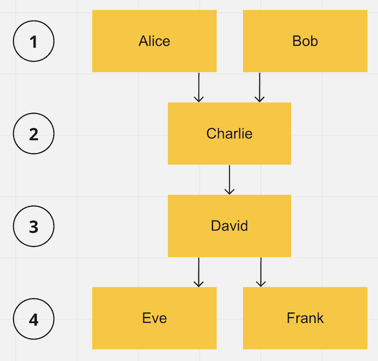

This page describes the **"Fast Swiss Tournament System"**.
The purpose of this page is to acquaint players with the nuances of this tournament system
and explain why it's perfectly suited for amateur table tennis tournaments.

# Brief description (tl;dr)

- All players are placed into a single group, like in a round-robin system.
- Yet, you won't compete against everyone. The number of matches that each participant will play is equal for all players, less than the
  overall number of
  possible opponents, and it is announced at the start of the tournament.
- Every round, you're paired with an opponent who demonstrates the most similar skill level among those you have not yet faced.
  Thus, throughout the tournament, you will play against opponents who possess a skill level close to your own.
- Your ranking isn't determined by your total wins, but through a process called topological sorting — a more equitable algorithm described
  below. In simpler terms, the table is structured to minimize, and ideally eliminate, instances where a winner of the match is positioned
  lower in the rankings than their defeated opponent.

That's enough to know if you don't care about the tournament system and just want to play.

# Detailed description

### Professional vs Amateur

In the world of professional tournaments, the commercial element is paramount.
Therefore, tournament systems that promise to engage the maximum number of _spectators_ are often chosen.
Audiences enjoy knockout matches (where the losing party is eliminated) and
thrillers (where the underdog has a real chance to outrank their predicted position).
This is served efficiently by the **playoff** system.

However, in the realm of amateur tournaments, the focus shifts towards the interests of the _participants_ themselves. The goals are to:

- Ensure that all participants get to play approximately the same number of matches since they all paid the same entry fee;
- Minimize the occurrence of dull "walkover" matches — games between competitors of vastly different skill levels;
- Reduce pauses between games and unoccupied tables;
- Aim to not only declare a winner but also objectively rank all participants.

### Traditional Swiss System

With these objectives in focus, elimination-style tournaments don't fare well. A more appealing system would be
the **round-robin** system (wherein everyone plays against everyone else). However, in the case of a large number of participants,
it can make the tournament overly long. Moreover, it fails to solve the issue of walkover matches.

When participants are split into **smaller groups**, the skill level within each group tends to vary so much that almost all matches
end up being walkovers. The real excitement lies in playing against opponents who match your level, making the outcome unpredictable!

The **Swiss** system addresses all the problems outlined above.
Under this system, all participants are brought together into a single group, as in the round-robin system,
and play matches against each other round by round. Unlike a preset tournament bracket, pairs for each successive round are picked only
after the completion of the preceding round, in such a way that players who are close to each other in the current tournament standings
meet.
The tournament ends before everyone plays against everyone else, thereby preventing matches between leaders and outsiders.

Nevertheless, this system comes with its own set of drawbacks significant for amateur tournaments:

1. Planning for the next round is possible only after the complete conclusion of the preceding one.
   This implies that players who finished their current match early must wait until all other participants have finished their games.
   While the last match of the round plays out, all other tables remain unoccupied, and all participants have to wait.

2. Another downside is the bias in ranking. A player who faced weaker opponents more often, and consequently won more matches,
   will rank higher than a stronger player who played more often against stronger opponents and thus won fewer games.

These obstacles are tackled by my own modification of the traditional Swiss system, which I called the **"Fast Swiss Tournament System"**.

## Fast Swiss Tournament System

Key differences of this system from the traditional Swiss system are:

### 1. Continuous Action

Instead of waiting for a round to conclude to schedule the next one, we will schedule just one next match each time a table becomes
available.
A pair for the next match is instantly selected from the players who are currently free and haven't played against each other yet.
The pairing is done by a secret algorithm in such a way that the players' skill levels match as closely as possible.

This ensures that all tables are always busy, and a maximum number of players are engaged every single moment, yet we stay true to the
spirit of the
Swiss system — participants play specifically against those who match their skill level.

### 2. Fairer Ranking

The participants' positions in the tournament table are determined not by the number of wins and losses,
but by a method called topological sorting. In simple terms:

- All players are ranked, starting from rank 1;
- Each next rank is assigned to the remaining unranked players who have the least number of losses to other unranked players,
  offset by the number of victories of already ranked players;
- Players sharing the same rank are ordered based on the results of their head-to-head matches.

To illustrate the explanation, let's consider an example:

- Players **A**lice and **B**ob won against **C**harlie
- **C**harlie won against **D**avid
- **D**avid won against **E**ve and **F**rank

In this tournament example, despite Charlie securing 1 victory and suffering 2 losses, and David earning 2 victories and 1 loss,
Charlie outperformed David in their match. This implies that Charlie is likely stronger and should be positioned higher in the table.
The topological ranking effectively achieves this (the ranks are indicated to the left of the player names in the above image).

How the ranking procedure works in this example:

- Initially, there are no ranked players. So players Alice and Bob, who have suffered the least number of losses (0), receive rank 1.
- Next, Charlie, who hasn't lost to any of the yet-to-be-ranked players, receives rank 2.
- Following the same logic, David receives rank 3.
- Eve and Frank are then assigned rank 4.

If there are no cyclical victories (X defeated Y, Y defeated Z, Z defeated X), then your rank will be next to the rank of the weakest
player you lost to.

The live tournament table, which includes the ranks of all players, will be continuously displayed on the screen throughout the tournament.

## Real Example

Beneath, you can observe a real tournament's final table illustration. Pay attention to the following:

1. Cases where a player with fewer victories is ranked above a player with more wins.
   Take, for instance, Uni is positioned higher than Melekhin. This occurs because Uni frequently faced stronger opponents, resulting in
   losses,
   whereas Melekhin usually engaged with less challenging competitors, leading to wins. Ultimately, Uni's victory over Melekhin serves as a
   testament to his superior skills.

2. Also, notice the higher density of games near the table's main diagonal. This pattern proves that matches between closely ranked players
   occur more frequently.

