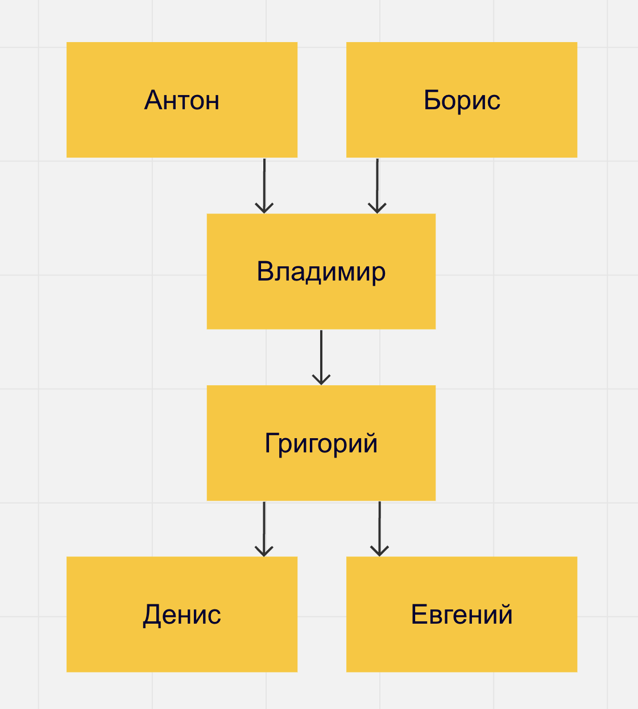
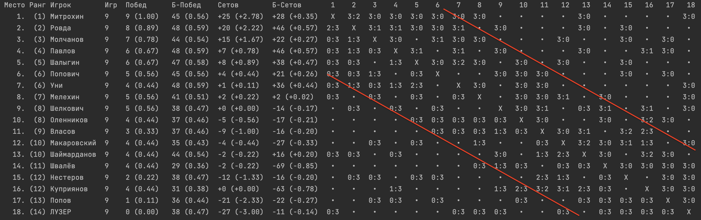

# О формате

В большинстве видов спорта каждый матч, будь то командный или индивидуальный, предполагает участие ровно двух соперников.
К числу таковых относятся футбол, волейбол, большой и настольный теннис, бильярд, шахматы, дота и многие другие.

Если в таких видах спорта требуется выявить лучшего среди множества соперников, проводится турнир — по сути, это серия матчей,
в которых пары соперников подбираются по определенным принципам в соответствии с форматом турнира.

Наиболее известные форматы турниров:

- турнир навылет (плей-офф, олимпийская система): проигравший выбывает из турнира;
- круговая система: каждый играет с каждым. Победитель определяется по количеству набранных очков.

При проведении профессиональных и любительских турниров цели могут отличаться.
В профессиональных турнирах важна коммерческая составляющая, поэтому организаторы заботятся, прежде всего, об удовлетворении интересов
зрителей. Для этого важно:

- максимизировать зрелищность — количество матчей между двумя сильными соперниками, в которых решается их судьба;
- оставить возможность для сенсации, чтобы слабый игрок имел шанс сотворить чудо и занять высокое место.

Система плей-офф блестяще справляется с этими целями, поэтому она часто применяется на решающих стадиях профессиональных турниров.

В то же время, при проведении любительских турниров важно удовлетворить прежде всего интересы самих участников.
На первый план выходят такие аспекты:

- предоставить всем участникам возможность сыграть примерно одинаковое количество матчей независимо от их уровня (так как все внесли
  одинаковый взнос);
- минимизировать количество "проходных" матчей — матчей между соперниками, уровень которых различается настолько, что результат
  предрешен заранее, а игра скучна для обоих соперников;
- минимизировать паузы у команд между матчами, а также, простой ресурсов (полей, столов, площадок и т.п. — в зависимости от вида спорта);
- не только выявить победителя, но и максимально объективно распределить всех участников по местам в турнирной таблице.

С этими целями турниры навылет справляются уже весьма плохо. Более предпочтительной системой в таком случае становится круговая.
Однако, в случае большого количества участников, она может сделать турнир чересчур долгим. Кроме того, не решается проблема
"проходных" матчей.

Обе эти проблемы решает **[Швейцарская система проведения турниров](https://ru.wikipedia.org/wiki/Швейцарская_система)**.
Она похожа на круговую — все участники попадают в единую группу, в рамках которой тур за туром проводят матчи между собой. Однако все
со всеми не сыграют. Турнир закончится раньше — после того, как будет сыграно заранее определённое количество туров.
При этом, каждый следующий тур планируется только после завершения предыдущего, и пары на него подбираются так, чтобы друг против друга
играли участники, занимающие близкие позиции в текущей турнирной таблице — а значит, имеющие схожий уровень игры.

Но эта система тоже обладает рядом недостатков, существенных для любительских турниров:

1. Спланировать очередной тур можно лишь после того, как полностью доигран предыдущий. Это значит,
   что игроки, доигравшие свой очередной матч, должны ждать, пока свои матчи доиграют все остальные участники турнира.
   Также простаивают ресурсы (поля, столы, площадки) — и пока доигрываются самые затянувшиеся матчи тура,
   и во время планирования очередного тура.

2. Второй минус этой системы — не очень объективная итоговая таблица. Участник А, чаще игравший со слабыми соперниками и поэтому
   выигравший больше матчей, окажется в таблице выше участника Б, который чаще играл с сильными соперниками, и поэтому выиграл меньше
   матчей,
   даже если он сильнее участника А.

Оба эти минуса решает моя доработка стандартной швейцарской системы, которую я назвал "Быстрая швейцарская система".

## Ключевые отличия от обычной швейцарской системы

### 1. Отсутствие простоев

Как только появляется свободный ресурс (поле, стол, площадка),
на основе результатов уже сыгранных матчей турнира оценивается сила всех участников,
и сразу, не дожидаясь окончания всего тура, запускается следующий матч между
максимально близкими по силе участниками, которые ещё не играли между собой, среди тех, кто сейчас не играет.
Таким образом, минимизируются паузы у участников между играми и устраняется простой ресурсов, но при этом сохраняется дух швейцарской
системы — участники играют именно с теми, кто максимально близок к ним по силе.

### 2. Более объективная итоговая таблица

Ещё одной важной особенностью данной системы является то, что места участников в таблице результатов определяются не количеством побед
и поражений, а на основе топологической сортировки участников.
То есть, прежде всего учитывается то, кого именно удалось победить, а кому проиграть.
Приведу пример для наглядности объяснения:

- игроки Антон и Борис выиграли у Владимира
- Владимир выиграл у Григория
- Григорий выиграл у Дениса и Евгения

Несмотря на то, что у Владимира 1 победа и 2 поражения, а у Григория 2 победы и 1 поражение,
всё же Владимир выиграл у Григория, а значит он, скорее всего, сильнее, и в таблице расположится выше.

Более формально, каждому игроку назначается ранг.

- Ранг игрока, который никому не проиграл — 1.
- Ранг каждого из оставшихся игроков — на единицу больше ранга самого слабого игрока, которому он проиграл.

Например, в описанном выше примере:

- Антон и Борис будут иметь ранг 1,
- Владимир — ранг 2,
- Григорий — ранг 3,
- а Денис и Евгений — ранг 4.

Именно по рангам игроков и сортируется текущая таблица результатов.

В случае циклических побед (А выиграл у Б, Б у В, В у А),
положение в таблице будет определяться дополнительными показателями (они описаны ниже).

Пары соперников на следующий матч подбираются так, чтобы ранги соперников были как можно ближе друг к другу.

# Памятка организатору турнира

### О гибкости программы

Программа сделана очень гибкой. Вот, например, что она позволяет:

1. Можно начинать турнир, даже когда ещё не все пришли: опоздавший участник может войти в турнир в любой момент.
   Ему с самого начала будут подбираться подходящие по уровню соперники, и он будет играть чаще,
   пока не догонит остальных по количеству сыгранных игр.
2. Можно в любой момент сменить количество доступных для игры столов: программа сразу подстроится и заполнит все свободные столы.
3. Можно по ходу турнира менять количество матчей, которые должен сыграть каждый человек, в зависимости от того, сколько времени аренды
   столов осталось. Система корректно подстроится. Но очевидно, система ничего не сможет сделать в случае,
   если кто-то уже сейчас сыграл больше матчей, чем должен согласно новым настройкам турнира. Поэтому лучше сначала поставить
   количество матчей поменьше (сколько мы точно успеем сыграть), а в процессе турнира увеличивать это число, если понятно, что остаётся
   время.
4. Организатор турнира в любой момент может вместо предложенных программой пар составить пару по своему желанию. Система это корректно
   обработает и учтёт это в своих дальнейших действиях (эта возможность доступна только в режиме запуска из командной строки)
5. Можно вносить любые исправления в прошлом: например, менять результат матча, убрать матч из списка сыгранных игр, добавить матч в
   список сыгранных игр, исправить состав соперников (эта возможность также доступна только в режиме запуска из командной строки)
6. Важно: запрещается ситуация, когда один участник играет с другим больше одного раза. Программа никогда не поставит какую-то пару второй
   раз. И при
   исправлении истории, также нельзя указывать, что какие-то игроки сыграли друг с другом больше одного раза — такие вводные будут
   некорректными.
7. Также нельзя исключить из турнира игрока, который сейчас сыграл хотя бы один раз. Удалить его из турнира можно только вместе
   со всей историей сыгранных им игр (результаты этих игр также удалятся и у его соперников).

Программа всегда следит за тем, чтобы сетка корректно складывалась при том, что каждый должен сыграть строго заданное количество игр.
Например, никогда не будет ситуации, что двум игрокам осталось доиграть по одной игре, но между собой они уже играли. Программа разрулит
эту ситуацию заблаговременно, выставив все пары так, чтобы в такую ситуацию не попасть.
Но это может оказаться невозможным в случае, если организатор турнира не следует рекомендациям программы, а ставит пары сам. Либо если
организатором внесено исправление в историю сыгранных игр, которое привело к тому, что спланировать оставшиеся игры корректно невозможно.

Если в турнире нечётное количество игроков, то ровно один игрок сыграет ровно на один матч меньше.

### Возможность поставить игрока на паузу

В интерфейсе командной строки, в строке с указанием имени игрока (`Игрок Антон`) можно поставить минус перед именем
игрока (`Игрок -Антон`) и таким образом указать,
что игрок отошёл, либо по каким-то другим причинам новые матчи с его участием назначать сейчас не нужно до тех пор,
пока не будет убран минус перед его именем. Действующий матч с его участием остаётся корректным и может быть успешно доигран, а его счёт
прописан. В интерфейсе бота постановка на паузу и снятие с неё делается специальной командой.

В случае постановки игрока на паузу, он остаётся полноценным участником турнира: сетка планируется с учётом того, что он в конце концов
сыграет нужное количество матчей.

### Как работает алгоритм выбора каждой следующей пары на матч

1. Берутся все свободные сейчас игроки (то есть те, которые не играют матч прямо сейчас и не поставлены на паузу)
2. Исключаются те, кто уже сыграл заданное в настройках количество матчей турнира
3. Из оставшихся после этого кандидатов составляются все возможные пары игроков
4. Исключаются пары, которые уже играли друг с другом
5. Исключаются пары, при выборе которых дальнейшая сетка турнира не может сойтись в принципе
   (то есть, мы окажемся в ситуации, когда двум игрокам осталось доиграть по одной игре, но между собой они уже играли)
6. Оставшиеся пары сравниваются по текущему рангу и
   за стол ставится пара игроков, которые максимально близки друг к другу по рангу на текущий момент.
7. При этом, приоритетом обладают игроки, которые сыграли на этом турнире меньше всего игр. Такие игроки, если есть возможность,
   ставятся к столу в первую очередь.

### Как организовать турнир

Прежде всего стоит забронировать столы (нехватка столов — это главный риск, способный сорвать проведение турнира).

Как правило, спортивные центры позволяют корректировать бронь, так что сократить время или отменить часть столов можно будет всегда.
А вот добавить — только если есть свободные. Поэтому лучше сначала всегда бронить по-максимуму, а за день до турнира можно позвонить и
сократить бронь, если потребуется.

Затем можно открывать запись и, когда количество игроков будет более-менее понятно, рассчитать реально необходимое количество столов
и длительность турнира.

1. Рассчитать количество столов. `T = floor(P / 3)`, где `P` — ожидаемое количество игроков, а `floor` – округление вниз, если потребуется.
   Почему именно столько.

Первый ориентир: процент времени, которое каждый конкретный игрок будет играть.
По опыту:

- 50% — очень мало, постоянно сидишь и скучаешь;
- 60% — всем комфортно, но основная масса, как мне кажется, хотела бы чуть интенсивнее;
- 62-65% — похоже на оптимум;
- 70% — выносливым норм, но наименее выносливые игроки от усталости выдыхаются и начинают заметно хуже играть.
  Поэтому изначально целимся на уровень на 66.6% (столов в 3 раза меньше числа игроков). Округляем вниз, чтобы было не больше 66.6%.
  Но в последние пару дней всегда кто-то отваливается, так что получится значение на несколько процентов выше изначального.

Второй ориентир: количество свободных игроков в тот момент, когда программа составляет очередную пару.
Чем меньше выбор пары на освободившийся стол — тем хуже соблюдается дух швейцарской системы (играть только с соперниками, близкими по
уровню).
Лучше, чтобы в момент выбора пары всегда было по крайней мере 5-7 ожидающих (а ближе к концу турнира — по крайней мере 6-8),
иначе далеко не всегда будет получаться составлять пары из более-менее равных соперников (особенно ближе к концу турнира).
Поэтому количество столов надо рассчитывать так, чтобы `2 * (T - 1) <= P - 6`

2. Рассчитать количество туров m. Желательно: `2 * log2(P) <= m <= 0.7 * (P - 1)`

- Минимум обусловлен тем, что при меньшем количестве туров велика вероятность, что таблица не успеет накопить
  полную объективность (особенно проблемная — средняя часть таблицы);
- Максимум обусловлен тем, что при большем количестве туров, всё чаще между собой будут играть сильные со слабыми, чего мы хотели бы
  избежать.

3. Рассчитать общее количество матчей `M = floor(m * P / 2)`

4. Рассчитать ожидаемую длительность турнира в минутах. `D = (M * d + 60) / T`,
   где d — длительность одного матча в минутах
   (11-12 минут для турниров по настольному теннису, которые играются до трёх побед в матчах до 11 очков).

Рассчитав все значения выше, можно откорректировать бронь столов.
Начать аренду стоит за 15 минут до начала турнира (чтобы игроки могли размяться),
а закончить через 15 минут после его завершения (чтобы был запас на случай, если турнир затянется относительно ожиданий).

Один стол надо отдать на час раньше — по озвученным выше причинам.

### Как настроить программу перед началом турнира в случае использования телеграм-бота

1. Запустить команду "/create_tournament". В ответ будет предложено внести все необходимые настройки
2. Добавить игроков командой "/add_player"
3. Запустить турнир командой "/go"

### Как настроить программу перед началом турнира в случае использования интерфейса командной строки

1. Необходимо внести настройки ("Столов", "Матчей", а также сформировать список игроков), убедиться что список сыгранных игр
   пуст.
2. Если число матчей, которые должен сыграть каждый человек, сильно меньше общего числа участников турнира, то лучше прописать гандикапы
   на основании рейтинга игроков или известного уровня. Это позволит в первых турах развести по разным играм игроков разного уровня, пока
   не успелась сформироваться достаточно объективная картина. В качестве альтернативы, можно составить пары вручную.
   Например, на 12 человек: 1 с 7, 2 с 8, ..., 6 с 12.
   Если же каждый в любом случае должен сыграть почти с каждым, то расставлять игроков по силе в первом круге не нужно,
   пусть машина всё сделает автоматически.
3. Если организатор тоже играет, то обязательно рассказать участникам, как пользоваться системой самостоятельно.
4. Раскрыть нижнюю панель на такую высоту, чтобы полностью помещалась таблица. Сверху открыть `tournament.txt`.

# Памятка участникам, как пользоваться программой самостоятельно во время турнира

### Если ты доиграл свой матч (в случае использования телеграм-бота)

1. Вызвать команду "/result" и внести результат матча
2. Посмотреть, кого программа следующими ставит к столу. **Обязательно (!)** им об этом сообщить.
3. При желании, можно посмотреть по ссылке обновлённую таблицу.

### Если ты доиграл свой матч (в случае использования интерфейса командной строки)

1. Внести в файл tournament.txt свой результат (он открыт в верхней части экрана). Просто через пробел результат первого и второго игрока.
2. Запустить программу (нажать на зелёный треугольник наверху экрана, либо Ctrl+R (^+R) на клавиатуре).
3. Посмотреть, кого программа следующими ставит к столу. **Обязательно (!)** им об этом сообщить.
4. При желании, можно посмотреть внизу экрана обновлённую таблицу.

### Как читать таблицу

Вот пример того, как выглядит таблица по итогам реального турнира:

Красными линиями отмечен наиболее плотный по доле сыгранных матчей кусок в середине матрицы. Это подтверждает то, что игроки
действительно наибольшее количество игр проводили с игроками схожего уровня.

1. Таблица отсортирована по текущему месту игрока в турнире, которое указывается в начале строки.
2. Затем указывается ранг игрока и его имя.
3. Затем указано количество сыгранных игр. Если игрок играет очередную игру сейчас — после числа выводится звёздочка.
4. Затем выводятся дополнительные показатели, такие как количество и процент побед, а также суммарная и средняя по матчу разница в счёте.
5. В правой части таблицы выводится матрица сыгранных игр.

Текущее место определяется рангом (правила подсчёта ранга описаны в начале страницы — в разделе "Что это за формат турнира и в чём его
фишка").
При равенстве ранга — результатами личных встреч игроков, имеющих одинаковый ранг, между собой (процент побед,
а в случае равенства — средний счёт).
Если и это не помогает, то ранг определяется по результатам всех матчей игрока (также, сначала по
проценту побед, затем по среднему счёту).

Так как в середине турнира у разных игроков может быть разное количество сыгранных на данный момент игр, в скобках к каждому показателю
указывается то же значение, нормированное по количеству сыгранных матчей (делённое на их количество).
И в ходе турнира сортировка таблицы производится именно по этому показателю.
